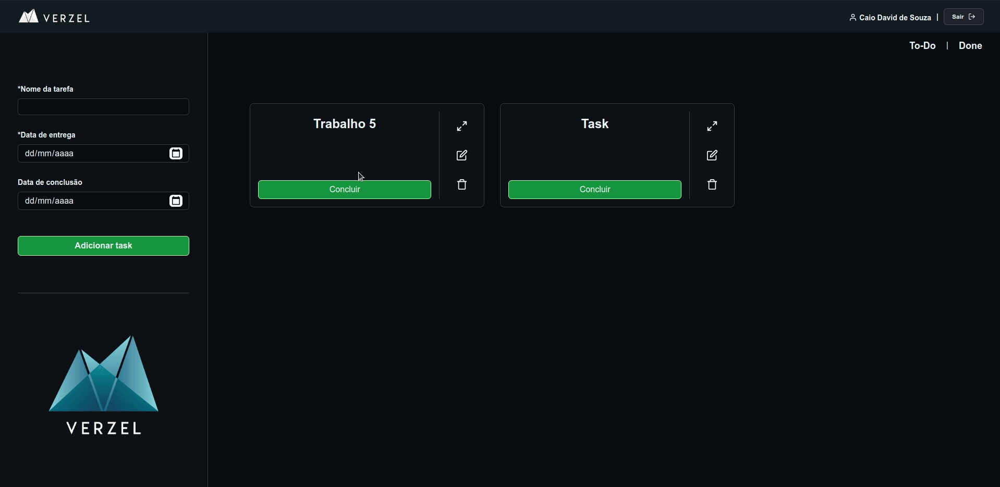
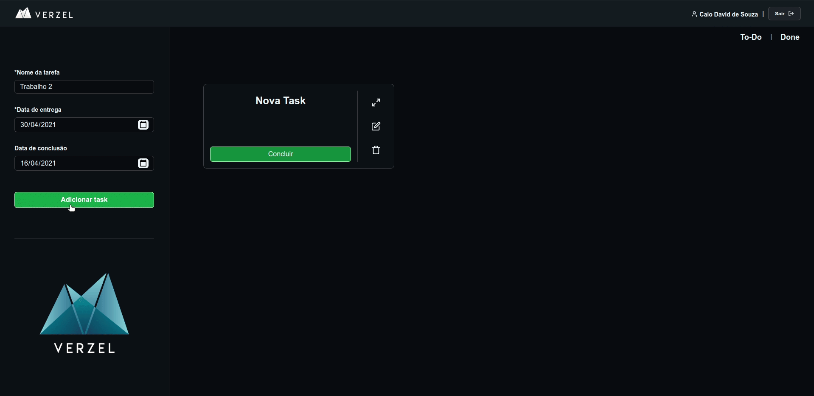
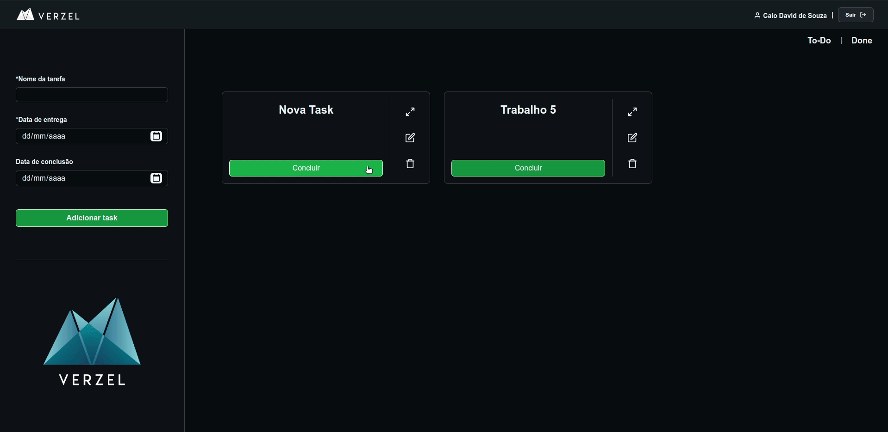
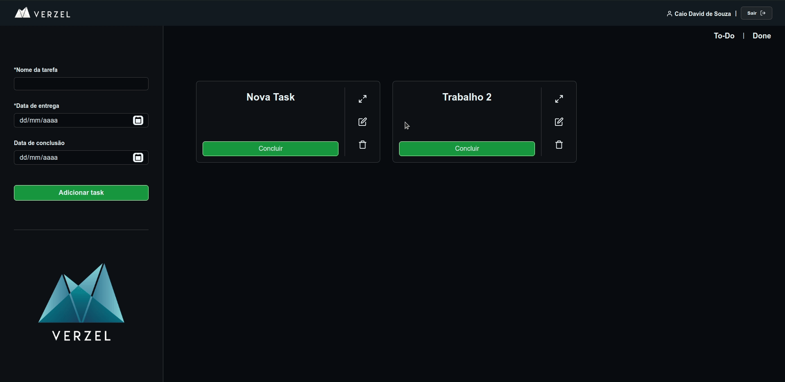

<h1 align="center">Verzel | To-Do List :ballot_box_with_check:</h1> 

  <a href="#page_with_curl-descrição-do-projeto">Descrição do projeto</a>&nbsp;&nbsp;&nbsp;|&nbsp;&nbsp;&nbsp;
  <a href="#bulb-proposta-de-solução">Proposta de soluçao</a>&nbsp;&nbsp;&nbsp;|&nbsp;&nbsp;&nbsp;
  <a href="#hammer-tecnologias-utilizadas">Tecnologias</a>&nbsp;&nbsp;&nbsp;|&nbsp;&nbsp;&nbsp;
  <a href="#computer-como-rodar-o-projeto">Como rodar</a>&nbsp;&nbsp;&nbsp;|&nbsp;&nbsp;&nbsp;
  <a href="#bookmark_tabs-requisitos-passados-pela-verzel">Requisitos</a>&nbsp;&nbsp;&nbsp;|&nbsp;&nbsp;&nbsp;

	

	

	
	
	
	

## :page_with_curl: Descrição do projeto
Teste prático pela Verzel no processo de seleção com o objetivo de validar os conhecimentos técnicos em desenvolvimento frontend, lógica de programação e entendimento da demanda proposta.

## :bulb: Proposta de solução
Desenvolver um sistema para cadastro de tarefas.

## :hammer: Tecnologias utilizadas
- [React](https://reactjs.org)
- [Node.js](https://nodejs.org/en/)
- [Redux](https://redux.js.org/)
- [Redux Persist](https://github.com/rt2zz/redux-persist)  

## :computer: Como rodar o projeto

**Você pode clonar o projeto e rodá-lo localmente seguindo os passos abaixo**

1. `$ git clone https://github.com/caiodavid/verzel-application-challenge.git` para clonar o projeto
2. `$ yarn` para instalar as dependências do projeto
3. `$ yarn start`
4. Acessar [http://localhost:3000](http://localhost:3000) no navegador
	
## :bookmark_tabs: Requisitos passados pela Verzel
### HomePage:

- Home page igual a página do github
- navbar com botão de entrar ou nome do usuário se estiver logado;
- form de cadastro por cima do banner;
- form de cadastro deve possuir os campos (nome, email, data de nascimento, cpf, cep, endereço, numero, senha);
- os campos nome, email, data de nascimento e senha são obrigatórios os outros são opcionais;
- apenas usuários maiores de 12 anos podem se cadastrar;
- o campo de CPF deve possuir mascara e validação de CPF;
- o CEP deve ser validado e possuir autocomplete de endereço;
	
### Após login:

- deve exibir uma listagem de tarefas cadastradas;
- deve possuir um botão para cadastro de novas tarefas;
- cada registro da listagem deve possuir as ações (editar, excluir, visualizar, concluir)
- a ação de concluir deve ser apenas para tarefas em aberto (não finalizadas), deve solicitar confirmação para concluir uma
tarefa;
- deve solicitar confirmação do usuário para excluir uma tarefa;
- o cadastro de tarefa deve possuir os campos (nome, data de entrega, data de conclusão);
- os campos nome e data de entrega são obrigatórios os outros são opcionais;
- cada usuário logado deve visualizar apenas as suas tarefas;
- Todos os dados devem ser persistidos no storage do browser;
- Escrever no readme os detalhes para setup da aplicação;
- Prazo para entrega 5 dias corridos a partir da data de recebimento do mesmo;

## Autor
---

<a href="https://github.com/caiodavid">

 
<b>Caio David de Souza</b></a> <a href="https://github.com/caiodavid" title="GitHub">🚀</a>

Feito com ❤️ por Caio 👋🏽 
